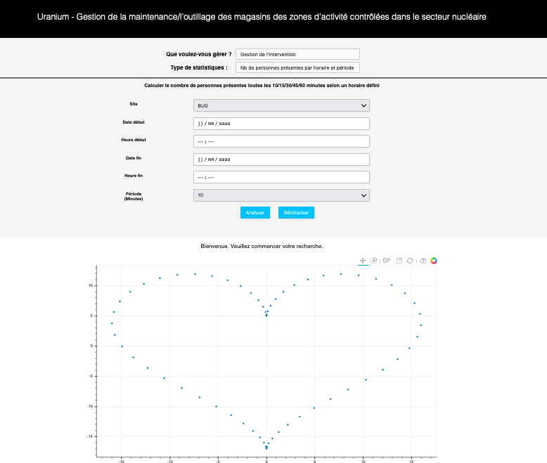
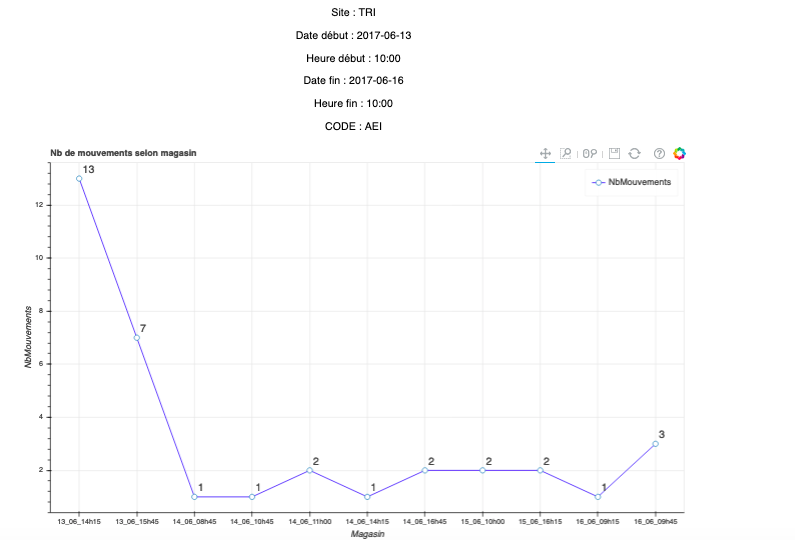

# Uranium - analytics web application

Uranium is a web application that allows the management of interventions and the management of tools in the controlled activity zones of the nuclear sector.

This is a school project, and I completed it with three classmates. Each of us was responsible for different parts, and I was mainly responsible for the coding of the entire web app.

## Documentation

[Documentation](Cahier_des_charges_PROJET_URANIUM.PDF)


## Built with

To launch the application and to ensure the display of graphics, you must install Python and the following packages:
- CherryPy
- Jinja2
- Boken (version 0.12.6)
- numpy
- pandas

## Usage

```
python ApplicationWeb.py
```

Given the amount of data, the application takes a little time to launch (about a minute) and to do a statistic (30 seconds).

To be able to see an example of the statistics displayed, you can consult the "Example_Display" folder.


## Screenshots





## License

[MIT](https://choosealicense.com/licenses/mit/)

